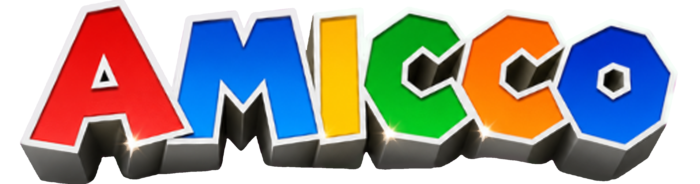

# 🍄 AMICCO - Find Your Wonder



> 🎮 Event kolaborasi antara dunia Mario & Wreck-It Ralph! Temukan keajaiban dalam setiap tantangan.

## 📌 Tentang Proyek

AMICCO adalah website event kompetisi yang menggabungkan tema retro game dengan modern design. Dibangun dengan pure HTML, CSS, dan JavaScript tanpa framework.

### ✨ Fitur

- 🎯 Loading Screen dengan progress bar interaktif
- 🌊 Background gradient smooth saat scroll
- ⌨️ Typing effect di hero section
- 📱 Fully responsive (mobile friendly)
- 🎨 Tema retro pixel art
- 📅 Timeline event interaktif
- 🖼️ Logo custom dengan drop shadow

### 🛠️ Tech Stack


### 📱 Preview

| Desktop | Mobile |
|---------|--------|
|  |  |

### 🚀 Quick Start

```bash
# Clone repository
git clone https://github.com/username/amicco-web.git

# Buka di browser
cd amicco-web
open index.html
